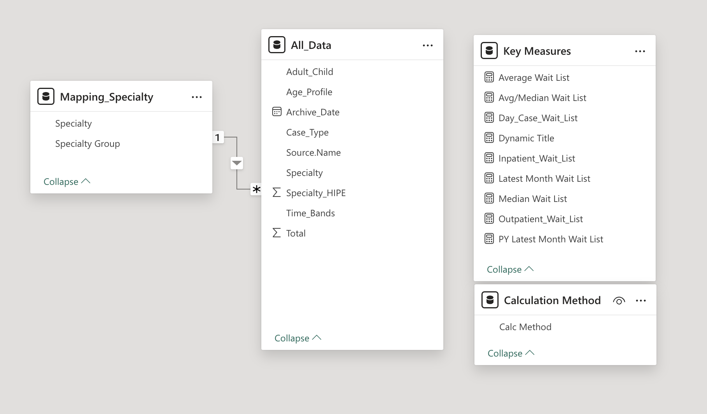
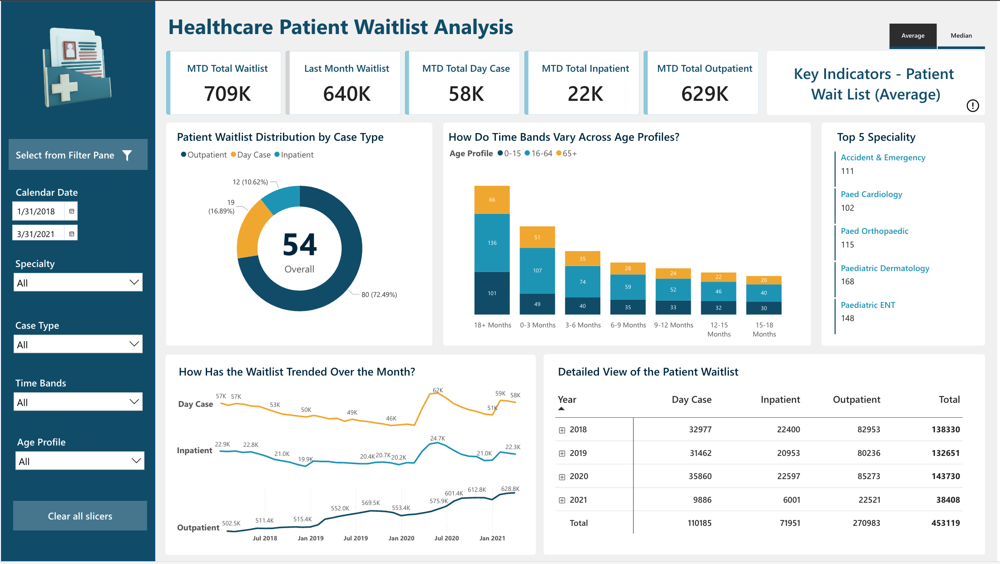
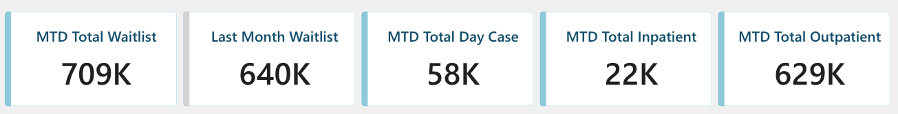
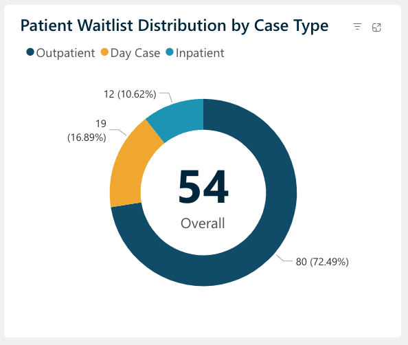
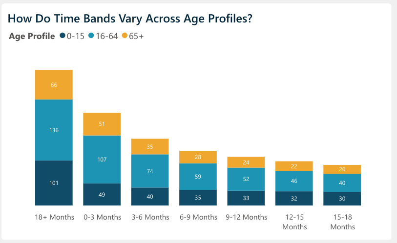
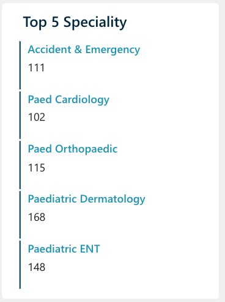
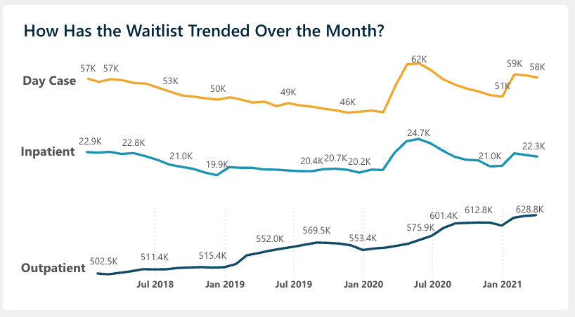

# Healthcare Patient Waitlist Analysis

 

## Table of Contents
- [Project Overview](#project-overview)
- [About The Dataset](#about-the-dataset)
- [Tools Used](#tools-used)
- [Visualization in Power BI:](#visualization-in-power-bi)
- [Project Analysis](#project-analysis)
- [Visuals in Power BI Live Report](#visuals-in-power-bi-live-report)
- [Recommendations](#recommendations)

## Project Overview
### Introduction:
The healthcare landscape has dramatically shifted over the past decade, bringing patient waitlist management to the forefront of hospital operations. With packed waiting rooms and stretched medical staff, understanding how to efficiently manage patient waitlists isn't just about numbers – it's about people waiting for care they urgently need. This analysis dives deep into the real-world challenges hospitals face in managing their growing waitlists. From elderly patients awaiting hip replacements to children needing specialist consultations, each number in the data represents someone's health journey. Healthcare systems face unprecedented pressure, driven by an aging population, advances in medical treatments, and the rising wave of chronic diseases.

### Objectives:
- Track current status of patient waiting list across all departments and specialties
- Analyze historical monthly trend of waiting list in Inpatient & Outpatient categories
- Detailed specialty level & age profile analysis of patient waitlist distribution

### About The Dataset
The dataset consists of multiple CSV files tracking patient waitlists from 2018 to 2021, separated into Inpatient (IN_WL) and Outpatient (OP_WL) categories. Each file captures detailed waiting list information across different specialties, age groups, and time periods. Additionally, a Mapping_Specialty.csv file provides specialty classification details. All files are in CSV (Comma Separated Values) format.

Each row represents a single waitlist record with standardized columns across both inpatient and outpatient datasets. The data structure is consistent throughout all years (2018-2021).

**Data Dictionary**
| Field                    | Description                            |            
|:------------------------ |:-------------------------------------- |
|Archive_DateDate| when the waitlist data was recorded
|Specialty_HIPE | Unique code identifying medical specialty
|Specialty_Name | Full name of the medical specialty
|Case_Type | Classification of patient case (Inpatient/Outpatient)
|Adult_Child |Patient age category (Adult/Child)
|Age_Profile | Detailed age group classification
|Time_Bands | Duration of time on waitlist
| Total | Number of patients in the specific category|

**Available Files:**

- IN_WL_2018.csv to IN_WL_2021.csv (Inpatient data)
- OP_WL_2018.csv to OP_WL_2021.csv (Outpatient data)
- Mapping_Specialty.csv (Specialty reference data)

### Skills Utilized
1. Data Cleaning
2. Data Visualization
3. Descriptive Analytics
4. Analytical and Critical Thinking
5. Problem Solving
6. Communication and Reporting

### Tools Used
1. Power Query
    - Was used to:
        1. Clean
        3. Transform the datasets for this analysis.
           
2. Power BI (Was used to create reports and dashboard for this analysis)
    - The following Power BI Features were incorporated:
        1. DAX
        2. Quick Measures
        3. Page Navigation
        4. Filters
        5. Tooltips
        6. Button

### Data Cleaning and Transformation Steps in Power Query:
1. Combined all inpatient waiting list files (**IN_WL_2018 to IN_WL_2021**) into one consolidated dataset.
2. Combined all outpatient waiting list files (**OP_WL_2018 to OP_WL_2021**) into one consolidated dataset.
3. Appended both inpatient and outpatient datasets into a single comprehensive file.
Validated and set appropriate data types for each column (**"Archive_Date"** as Date, **"Total"** as Whole Number, and remaining columns as Text).
4. Trimmed all text columns to remove any leading or trailing spaces.
5. Performed data quality checks to ensure consistency across all years of data.

## Data Modelling
The data model created consists of three key tables connected through appropriate relationships:

1. All_Data: Main fact table containing the waitlist records with metrics like Total patients and various attributes like Adult_Child, Age_Profile, Time_Bands, Case_Type, and Archive_Date.

2. Mapping_Specialty: Dimension table storing specialty classifications and groupings, connected to All_Data through Specialty field using a one-to-many relationship.

3. Key Measures: Separate DAX measures table holding all calculated metrics including:

    - Average Wait List = AVERAGE(All_Data[Total]) 
    - Avg/Med Wait List = SWITCH(VALUES('Calculation Method'[Calc Method]),"Average",[Average Wait List],"Median",[Median Wait List]) 
    - Day_Case_Wait_List = CALCULATE(SUM(All_Data[Total]),All_Data[Case_Type] = "Day Case",All_Data[Archive_Date] = MAX(All_Data[Archive_Date]))
    - Inpatient Wait List = CALCULATE(SUM(All_Data[Total]),All_Data[Case_Type] = "Inpatient",All_Data[Archive_Date] = MAX(All_Data[Archive_Date]))
    - Outpatient Wait List = CALCULATE(SUM(All_Data[Total]),All_Data[Case_Type] = "Outpatient",All_Data[Archive_Date] = MAX(All_Data[Archive_Date]))
    - Latest Month Wait List = CALCULATE(SUM(All_Data[Total]),All_Data[Archive_Date] = MAX(All_Data[Archive_Date])) + 0

    - PY Latest Month Wait List = CALCULATE(SUM(All_Data[Total]),All_Data[Archive_Date]= EDATE(MAX(All_Data[Archive_Date]),-12)) + 0
      

This star schema design allows for efficient analysis and reporting of waitlist trends across different specialties and time periods.

## Visualization in Power BI:

### Project Analysis:

- The total Month-to-Date (MTD) waitlist reached 709K patients, with the most recent month showing 640K patients waiting for treatment.
- Outpatient services dominated the waitlist with 629K patients (89% of total waitlist), indicating significant pressure on ambulatory care services.
- Inpatient cases represented a smaller portion with 22K patients (3% of total waitlist), suggesting more efficient management of hospital admission cases.
- Day case procedures accounted for 58K patients (8% of total waitlist), representing cases that require same-day hospital services.
- The gap between total waitlist (709K) and last month's figure (640K) shows a 69K increase, indicating growing pressure on healthcare services.
- The combined Day Case and Inpatient total of 80K (11% of waitlist) compared to Outpatient's 629K suggests potential bottlenecks in outpatient clinic capacity.

#### Case Type Distribution Analysis

 
 
The analysis of average patient waitlist distribution reveals a significant imbalance across different case types. On average, outpatient cases clearly dominate the waitlist, accounting for 72.49% (80 patients) of all cases, highlighting the substantial pressure on outpatient services. Day Case procedures represent the second-largest category with an average of 16.89% (19 patients), suggesting a moderate demand for same-day surgical and diagnostic procedures. Inpatient cases make up the smallest portion with an average of 10.62% (12 patients), indicating relatively better management of cases requiring hospital admission. This average distribution pattern, with an overall average of 54 patients, suggests that healthcare resources might need to be reallocated to better address the disproportionate demand for outpatient services, while maintaining the apparently effective management of inpatient cases. The consistently higher percentage of outpatient cases might also indicate potential bottlenecks in the outpatient appointment system or possible opportunities for converting some outpatient procedures to day cases to improve overall patient flow.

#### Analysis of Average Wait Times Across Age Profiles

 

The analysis reveals significant patterns in average waiting times across age groups. The 18+ months category shows the highest average numbers, with working-age adults (16-64) averaging 136 patients, children (0-15) at 101, and seniors (65+) at 66. This indicates a persistent challenge with long-wait cases.
There's a clear downward trend from longer to shorter wait times, with the 0-3 month band averaging significantly lower numbers (49 children, 107 adults, 51 seniors). The working-age group consistently represents the largest segment across all time bands, while the elderly population maintains relatively stable averages throughout different waiting periods. This pattern suggests that while new cases are being managed, there's an ongoing accumulation of long-wait cases across all age groups, with particular pressure on services for working-age adults.

#### Analysis of Average Waitlist by Top 5 Specialties

 

The analysis of top five specialties by average waitlist numbers shows Pediatric Dermatology with the highest average of 168 patients per month, followed by Pediatric ENT averaging 148 patients. On average, Pediatric Orthopedic services maintain 115 patients on their waitlist, while Accident & Emergency averages 111 patients, and Pediatric Cardiology sees an average of 102 patients.
Notably, four out of the five top specialties are pediatric services, indicating a consistent high demand for children's healthcare services. The presence of Accident & Emergency among these top specialties, with an average of 111 patients, suggests ongoing pressure on emergency care services alongside specialized pediatric care. These average figures highlight areas where resource allocation and capacity planning might need particular attention to address sustained high waitlist volumes.

#### Analysis of Waitlist Trends (July 2018 - January 2021)
The average waitlist trends across different case types show distinct patterns over the 2.5-year period:

- **Outpatient Services**
Shows a consistent upward trend, starting from 502.5K in July 2018 and reaching 628.8K by January 2021. There was a notable acceleration in growth from January 2020 (553.4K) to July 2020 (601.4K), possibly influenced by the pandemic's impact. This represents a significant 25% increase over the entire period.

- **Day Case Procedures**
Displays a fluctuating pattern with an overall declining trend from July 2018 (57K) until January 2020 (46K), followed by a sharp spike to 62K in July 2020. The numbers then stabilized around 58-59K by January 2021. The sharp increase in mid-2020 might indicate a backlog of postponed procedures during the early pandemic period.

- **Inpatient Cases**
Shows the most stable trend among all categories, fluctuating between 19.9K and 24.7K. There was a noticeable peak in July 2020 (24.7K), aligning with the spikes seen in other categories, before returning to more typical levels around 22.3K by January 2021.
The synchronized peaks across all categories in July 2020 suggest a system-wide impact, likely related to healthcare service disruptions during the pandemic period.

## Visuals in Power BI Live Report:
You can view and interact with this dashboard on Healthcare Patient Waitlist analysis [here](https://app.powerbi.com/view?r=eyJrIjoiMDA2Y2EzNWEtNDJlYS00MDk3LTg4ODUtMjk2OWVjNWM3YjgwIiwidCI6ImRmODY3OWNkLWE4MGUtNDVkOC05OWFjLWM4M2VkN2ZmOTVhMCJ9).

### Recommendations

1. **Outpatient Capacity Enhancement** - Given the consistent upward trend in outpatient waitlists (reaching 628.8K), prioritize increasing outpatient clinic capacity through extended hours and additional clinics. Consider implementing virtual consultations where appropriate to manage the growing demand.

2. **Pediatric Services Focus** - With four out of five top specialties being pediatric services, develop dedicated strategies for pediatric care. Consider establishing specialized pediatric assessment units and increasing specialist staff in high-demand areas like Dermatology (168 average patients) and ENT (148 average patients).

3. **Long-Wait Cases Management** - Address the concentration of cases in the 18+ months category by:
   - Implementing a fast-track system for cases exceeding 12-month wait time
    - Developing specific intervention plans for working-age adults (16-64) who show consistently higher numbers
    - Creating dedicated pathways for elderly patients to prevent extended wait times

4. **Resource Optimization** - Balance resource allocation across Day Case (averaging 46K-62K patients) and Inpatient services (averaging 19.9K-24.7K patients) by:
    - Converting suitable inpatient procedures to day cases where clinically appropriate
    - Implementing efficient scheduling systems to minimize unused capacity
    - Developing clear pathways for case type transitions based on patient needs

5. **Data-Driven Planning** - Continue monitoring trends across all service types to:
    - Anticipate seasonal variations and plan resources accordingly
    - Identify early warning signs of increasing wait times
    - Adjust capacity planning based on demographic needs and service demands
 

## Thank You For Following Through!

